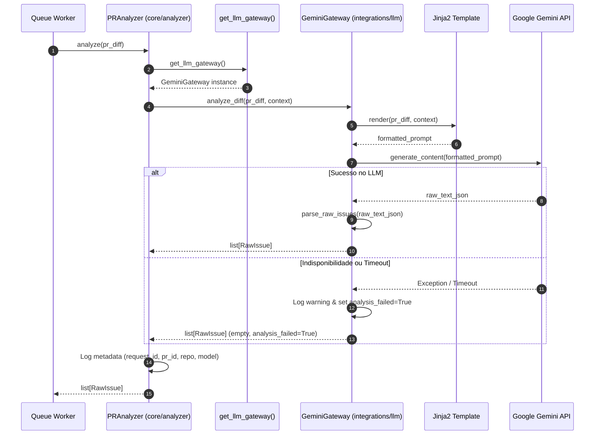

## Context

Veja [proposal.md](file:///d:/bkp%20do%20meu%20pc/Pos%20Lato%20Sensu%20-%20Engenharia%20de%20software/Fundamentos%20de%20IA%20Generativa%20e%20Princ%C3%ADpios%20de%20Produtividade/agent-codereview/opencode/openspec/changes/ch-04-llm-gateway-analyzer/proposal.md) e [spec.md](file:///d:/bkp%20do%20meu%20pc/Pos%20Lato%20Sensu%20-%20Engenharia%20de%20software/Fundamentos%20de%20IA%20Generativa%20e%20Princ%C3%ADpios%20de%20Produtividade/agent-codereview/opencode/openspec/changes/ch-04-llm-gateway-analyzer/specs/llm-gateway-analyzer/spec.md) para a motivação, requisitos funcionais e não-funcionais (RF-05, RF-06, RNF-01, RNF-05, RNF-07, RNF-13, RNF-14).

A arquitetura do sistema segue o padrão de desacoplamento por gateways (`integrations/llm`), permitindo que a camada de orquestração (`core/analyzer`) execute a análise de código sem depender diretamente da SDK do provedor de IA (Google Gemini ou OpenAI).

Componentes afetados:
- `opencode/src/integrations/llm/` (gateways, modelos e templates)
- `opencode/src/core/analyzer/` (orquestrador de análise `PRAnalyzer`)
- `opencode/tests/` (testes unitários e de integração)

---

## Goals / Non-Goals

**Goals:**
- Implementar a classe base abstrata `LLMGateway` com interface `async def analyze_diff(diff: PRDiff, context: str) -> list[RawIssue]`.
- Implementar o gateway concreto `GeminiGateway` utilizando o SDK oficial do Google Gemini API.
- Implementar stub expansível `OpenAIGateway` para suportar futura troca via `LLM_PROVIDER` no `settings.py`.
- Criar o template Jinja2 de prompt (`integrations/llm/templates/analysis_prompt.j2`) com diretrizes rígidas de checagem de OWASP Top 10 e qualidade de código.
- Implementar parser defensivo para extrair e validar a estrutura JSON da resposta do LLM em instâncias de `RawIssue`.
- Implementar o orquestrador `PRAnalyzer` que consome `LLMGateway` e grava metadados de execução rastreáveis sem persistir nem logar o diff.
- Implementar mecanismo de fallback em caso de erro HTTP, timeout ou falha na API do LLM (`analysis_failed: true`).

**Non-Goals:**
- Não realiza classificação de severidade final (CRÍTICO, ALTO, MÉDIO, BAIXO) nem mapeamento de estado de review (`REQUEST_CHANGES`) — tratado em CH-05 (`core/classifier`).
- Não publica comentários ou reviews no GitHub API — tratado em CH-06 (`core/reporter`).
- Não implementa suporte a configurações dinâmicas de repositório (`.codereview.yml`) — escopo pós-MVP (CH-09).

---

## Decisions

### Decisão 1: Abstração do LLM via `LLMGateway` (Abstract Base Class) e Factory Function
- **Abordagem:** Definir `LLMGateway(ABC)` com o método assíncrono `analyze_diff()`. Criar uma factory `get_llm_gateway()` que lê `settings.LLM_PROVIDER` ("gemini" ou "openai") e retorna a instância correspondente.
- **Justificativa:** Garante conformidade estrita com RNF-13 (troca de provedor sem impacto no `core`). Permite injetar gateways falsos (mocks) em testes unitários sem chamadas de rede.
- **Alternativas consideradas:**
  - *Função direta chamando a API do Gemini:* Rejeitada por acoplar o `core` ao SDK do Gemini e violar RNF-13.
  - *Usar LangChain / LlamaIndex:* Rejeitado por adicionar dependências pesadas e desnecessárias para um MVP onde um prompt estruturado Jinja2 é suficiente.

### Decisão 2: Prompt Jinja2 com Formatação JSON Rígida e Parsing Defensivo
- **Abordagem:** O prompt em `integrations/llm/templates/analysis_prompt.j2` instrui o LLM a responder exclusivamente em formato JSON array. O parser em `GeminiGateway` aplica regex para remover eventuais delimitadores markdown (` ```json ... ``` `) antes de invocar `pydantic` / `json.loads`.
- **Justificativa:** LLMs ocasionalmente formatam JSON dentro de blocos de código markdown. O parser defensivo previne falhas sintáticas evitáveis. Se o JSON for irrecuperável, o parser grava warning e retorna lista vazia de `RawIssue` ativando o fallback de forma segura.
- **Alternativas consideradas:**
  - *Forçar resposta em texto livre:* Rejeitada por dificultar o parsing preciso de arquivo, linha e categoria de problema.

### Decisão 3: Orquestrador `PRAnalyzer` e Logs de Auditoria sem Retenção de Código
- **Abordagem:** `PRAnalyzer` recebe `PRDiff`, injeta o identificador de execução `request_id`, invoca `LLMGateway.analyze_diff()` e registra logs estruturados com `request_id`, `pr_id`, `repository`, `model_version`, `timestamp`.
- **Justificativa:** Atende RNF-14 (logs rastreáveis) e RNF-07 (privacidade / não retenção do código). Nenhum snippet do diff ou chave `GEMINI_API_KEY` é interpolado nas mensagens de log.
- **Alternativas consideradas:**
  - *Logar o diff em nível DEBUG:* Rejeitado por violar RNF-07 e RNF-14 (segurança e conformidade LGPD/GDPR).

### Decisão 4: Tratamento de Timeouts e Fallback Gracioso (RNF-05)
- **Abordagem:** Requisições ao LLM possuem timeout assíncrono configurado via `settings.LLM_TIMEOUT_SECONDS` (padrão: 180s / 3min). Exceções de timeout ou de rede são capturadas, gerando retorno com a flag `analysis_failed: true`.
- **Justificativa:** Diffs de até 500 linhas devem ser analisados em até 3 minutos (RNF-01). Se o LLM falhar, o pipeline não deve quebrar nem travar o worker (RNF-05).

---

## Diagrama da Arquitetura do Analyzer & LLM Gateway



---

## Risks / Trade-offs

| Risco | Impacto | Mitigação |
|-------|---------|-----------|
| **Resposta LLM com JSON truncado/malformado** | Alto | Regex parser defensivo + bloco `try/except json.JSONDecodeError` logando aviso e retornando parcial/vazio com `analysis_failed: true`. |
| **Vazamento acidental de `GEMINI_API_KEY` em logs** | Crítico | Chave lida via Pydantic `SecretStr` em `settings.py`; nunca concatenada em f-strings de logs. |
| **Estouro de cota ou Rate Limit na Gemini API** | Médio | Tratamento da exceção da SDK com fallback automático de regras estáticas (RNF-05). |
| **Latência da API LLM > 3 min para diffs de 500 linhas** | Médio | Configuração de timeout estrito (`asyncio.wait_for` ou timeout nativo da SDK HTTP client). |

---

## Migration Plan

1. Nenhuma alteração no esquema do banco de dados ou estado persistente.
2. Adicionar dependência do SDK do Gemini (`google-generativeai` / `google-genai`) em `requirements.txt`.
3. Adicionar variáveis `GEMINI_API_KEY`, `LLM_PROVIDER`, `LLM_TIMEOUT_SECONDS` em `.env.example` e `config/settings.py`.
4. Em ambiente de homologação/produção, validar a chave `GEMINI_API_KEY` com um teste de fumaça sem chamada aos testes automatizados de CI (CI utiliza mocks estritos).
