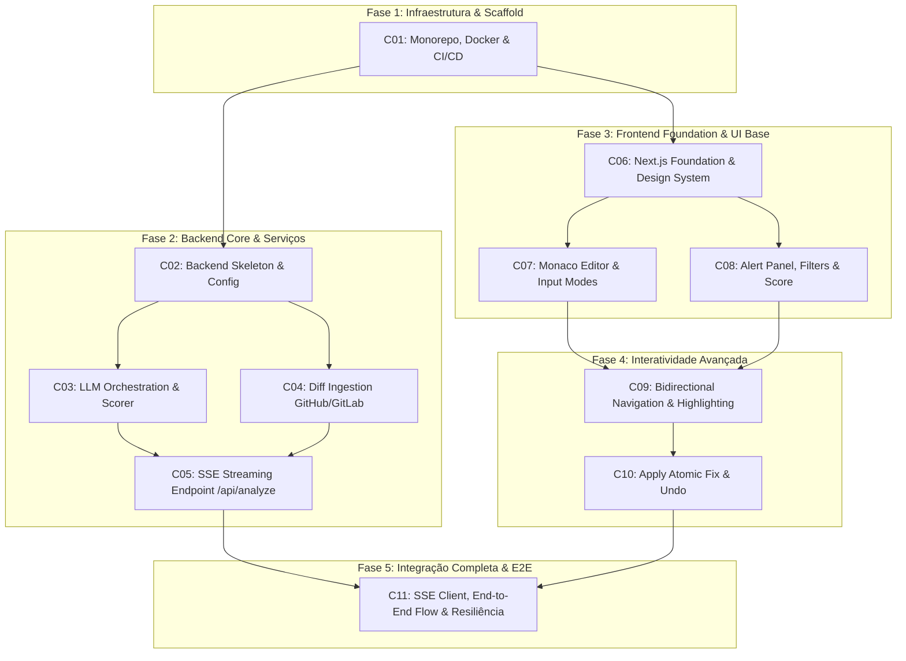

# Roadmap de Implementação Incremental — Agent Code Review

Este documento apresenta o planejamento incremental e faseado para a implementação da aplicação web full stack **Agent Code Review**, em estrita conformidade com os requisitos de [`docs/prd.md`](file:///d:/bkp%20do%20meu%20pc/Pos%20Lato%20Sensu%20-%20Engenharia%20de%20software/Fundamentos%20de%20IA%20Generativa%20e%20Princ%C3%ADpios%20de%20Produtividade/agent-codereview/docs/prd.md), [`docs/spec.md`](file:///d:/bkp%20do%20meu%20pc/Pos%20Lato%20Sensu%20-%20Engenharia%20de%20software/Fundamentos%20de%20IA%20Generativa%20e%20Princ%C3%ADpios%20de%20Produtividade/agent-codereview/docs/spec.md), [`docs/architecture.md`](file:///d:/bkp%20do%20meu%20pc/Pos%20Lato%20Sensu%20-%20Engenharia%20de%20software/Fundamentos%20de%20IA%20Generativa%20e%20Princ%C3%ADpios%20de%20Produtividade/agent-codereview/docs/architecture.md) e os protótipos UI aprovados no Stitch (`projects/13291530933302315320`).

---

## 1. Diretrizes de Governança e Regras Invioláveis

1. **Critério de Risco e Complexidade Máxima**: Nenhuma mudança possui tamanho, complexidade ou risco classificado como **Alto**. O escopo foi fatiado de modo que todas as alterações permaneçam em **Pequeno** ou **Médio**.
2. **Definição de Concluído (DoD)**: Nenhuma mudança é considerada concluída sem:
   - Execução limpa de Linters e Typecheckers (`ruff check`, `ruff format`, `mypy --strict`, `npm run lint`, `tsc --noEmit`).
   - Cobertura de testes unitários mínima de 80% em `backend/src/core`.
   - Testes de integração correspondentes passando com mocks de bordas externas (`respx`, `unittest.mock`).
   - Testes E2E (quando aplicável ao fluxo) automatizados ou via subagente de browser.
3. **Segurança e Privacidade**:
   - `GEMINI_API_KEY`, `GITHUB_TOKEN` e `GITLAB_TOKEN` são manipulados **exclusivamente** pelo backend via variáveis de ambiente.
   - O código ou diff submetido para análise **nunca é persistido** em banco de dados nem gravado em logs (Stateless - ADR-02).
   - Sem chamadas diretas ao Gemini pelo client.

---

## 2. Protótipos UI de Referência (Stitch)

As mudanças de frontend baseiam-se nos protótipos aprovados no Stitch (`projects/13291530933302315320`):

| Tela / Componente Stitch | Descrição no Protótipo | Mudança Associada |
|---|---|---|
| **Review Playground & Alertas Inline** (`c81eb560...`) | Layout dividido: Monaco Editor à esquerda com marcadores gutter/inline e Alert Panel à direita | [C06](file:///d:/bkp%20do%20meu%20pc/Pos%20Lato%20Sensu%20-%20Engenharia%20de%20software/Fundamentos%20de%20IA%20Generativa%20e%20Princ%C3%ADpios%20de%20Produtividade/agent-codereview/openspec/changes/c06-frontend-foundation/proposal.md), [C07](file:///d:/bkp%20do%20meu%20pc/Pos%20Lato%20Sensu%20-%20Engenharia%20de%20software/Fundamentos%20de%20IA%20Generativa%20e%20Princ%C3%ADpios%20de%20Produtividade/agent-codereview/openspec/changes/c07-frontend-editor-input-modes/proposal.md), [C08](file:///d:/bkp%20do%20meu%20pc/Pos%20Lato%20Sensu%20-%20Engenharia%20de%20software/Fundamentos%20de%20IA%20Generativa%20e%20Princ%C3%ADpios%20de%20Produtividade/agent-codereview/openspec/changes/c08-frontend-alert-panel-filters-score/proposal.md), [C09](file:///d:/bkp%20do%20meu%20pc/Pos%20Lato%20Sensu%20-%20Engenharia%20de%20software/Fundamentos%20de%20IA%20Generativa%20e%20Princ%C3%ADpios%20de%20Produtividade/agent-codereview/openspec/changes/c09-frontend-bidirectional-nav-highlighting/proposal.md), [C10](file:///d:/bkp%20do%20meu%20pc/Pos%20Lato%20Sensu%20-%20Engenharia%20de%20software/Fundamentos%20de%20IA%20Generativa%20e%20Princ%C3%ADpios%20de%20Produtividade/agent-codereview/openspec/changes/c10-frontend-apply-fix-undo/proposal.md) |
| **Relatório & Code Health Score** (`93be55c0...`) | Indicador circular/badge do Score (0–100), tags de categoria (Segurança, Performance, Manutenibilidade, Concorrência), filtros por severidade | [C08](file:///d:/bkp%20do%20meu%20pc/Pos%20Lato%20Sensu%20-%20Engenharia%20de%20software/Fundamentos%20de%20IA%20Generativa%20e%20Princ%C3%ADpios%20de%20Produtividade/agent-codereview/openspec/changes/c08-frontend-alert-panel-filters-score/proposal.md), [C11](file:///d:/bkp%20do%20meu%20pc/Pos%20Lato%20Sensu%20-%20Engenharia%20de%20software/Fundamentos%20de%20IA%20Generativa%20e%20Princ%C3%ADpios%20de%20Produtividade/agent-codereview/openspec/changes/c11-frontend-sse-integration-error-handling/proposal.md) |
| **Ingestão de PR/MR & Diffs Side-by-Side** (`4b2ce436...`) | Modal/aba de ingestão por URL de PR (GitHub) ou MR (GitLab), aviso de truncamento (>500 linhas) e visualizador de diff side-by-side | [C04](file:///d:/bkp%20do%20meu%20pc/Pos%20Lato%20Sensu%20-%20Engenharia%20de%20software/Fundamentos%20de%20IA%20Generativa%20e%20Princ%C3%ADpios%20de%20Produtividade/agent-codereview/openspec/changes/c04-backend-diff-ingestion/proposal.md), [C07](file:///d:/bkp%20do%20meu%20pc/Pos%20Lato%20Sensu%20-%20Engenharia%20de%20software/Fundamentos%20de%20IA%20Generativa%20e%20Princ%C3%ADpios%20de%20Produtividade/agent-codereview/openspec/changes/c07-frontend-editor-input-modes/proposal.md), [C11](file:///d:/bkp%20do%20meu%20pc/Pos%20Lato%20Sensu%20-%20Engenharia%20de%20software/Fundamentos%20de%20IA%20Generativa%20e%20Princ%C3%ADpios%20de%20Produtividade/agent-codereview/openspec/changes/c11-frontend-sse-integration-error-handling/proposal.md) |
| **Identidade Visual & Branding** (`fe7f3d87...`) | Logo oficial, paleta dark mode profissional, tipografia e ícones de status | [C01](file:///d:/bkp%20do%20meu%20pc/Pos%20Lato%20Sensu%20-%20Engenharia%20de%20software/Fundamentos%20de%20IA%20Generativa%20e%20Princ%C3%ADpios%20de%20Produtividade/agent-codereview/openspec/changes/c01-infra-monorepo-ci-cd/proposal.md), [C06](file:///d:/bkp%20do%20meu%20pc/Pos%20Lato%20Sensu%20-%20Engenharia%20de%20software/Fundamentos%20de%20IA%20Generativa%20e%20Princ%C3%ADpios%20de%20Produtividade/agent-codereview/openspec/changes/c06-frontend-foundation/proposal.md) |

---

## 3. Matriz Consolidada de Mudanças

| ID | Mudança | Tamanho | Complexidade | Risco | Dependências |
|---|---|:---:|:---:|:---:|---|
| **[C01](file:///d:/bkp%20do%20meu%20pc/Pos%20Lato%20Sensu%20-%20Engenharia%20de%20software/Fundamentos%20de%20IA%20Generativa%20e%20Princ%C3%ADpios%20de%20Produtividade/agent-codereview/openspec/changes/c01-infra-monorepo-ci-cd/proposal.md)** | Infraestrutura, Monorepo, Docker & CI/CD | Pequeno | Baixa | Baixo | — |
| **[C02](file:///d:/bkp%20do%20meu%20pc/Pos%20Lato%20Sensu%20-%20Engenharia%20de%20software/Fundamentos%20de%20IA%20Generativa%20e%20Princ%C3%ADpios%20de%20Produtividade/agent-codereview/openspec/changes/c02-backend-core-skeleton/proposal.md)** | Backend Core Skeleton (FastAPI + Config + Health) | Pequeno | Baixa | Baixo | C01 |
| **[C03](file:///d:/bkp%20do%20meu%20pc/Pos%20Lato%20Sensu%20-%20Engenharia%20de%20software/Fundamentos%20de%20IA%20Generativa%20e%20Princ%C3%ADpios%20de%20Produtividade/agent-codereview/openspec/changes/c03-backend-llm-orchestration/proposal.md)** | Backend LLM Orchestration, Pydantic & Scorer | Médio | Média | Médio | C02 |
| **[C04](file:///d:/bkp%20do%20meu%20pc/Pos%20Lato%20Sensu%20-%20Engenharia%20de%20software/Fundamentos%20de%20IA%20Generativa%20e%20Princ%C3%ADpios%20de%20Produtividade/agent-codereview/openspec/changes/c04-backend-diff-ingestion/proposal.md)** | Backend Diff Ingestion (GitHub + GitLab + Truncate) | Pequeno-Médio | Baixa | Baixo | C02 |
| **[C05](file:///d:/bkp%20do%20meu%20pc/Pos%20Lato%20Sensu%20-%20Engenharia%20de%20software/Fundamentos%20de%20IA%20Generativa%20e%20Princ%C3%ADpios%20de%20Produtividade/agent-codereview/openspec/changes/c05-backend-sse-analyze-endpoint/proposal.md)** | Backend SSE Streaming Endpoint `/api/analyze` | Médio | Média | Médio | C03, C04 |
| **[C06](file:///d:/bkp%20do%20meu%20pc/Pos%20Lato%20Sensu%20-%20Engenharia%20de%20software/Fundamentos%20de%20IA%20Generativa%20e%20Princ%C3%ADpios%20de%20Produtividade/agent-codereview/openspec/changes/c06-frontend-foundation/proposal.md)** | Frontend Foundation (Next.js 15, Design System, Types) | Pequeno | Baixa | Baixo | C01 |
| **[C07](file:///d:/bkp%20do%20meu%20pc/Pos%20Lato%20Sensu%20-%20Engenharia%20de%20software/Fundamentos%20de%20IA%20Generativa%20e%20Princ%C3%ADpios%20de%20Produtividade/agent-codereview/openspec/changes/c07-frontend-editor-input-modes/proposal.md)** | Frontend Monaco Editor + Modos de Entrada | Médio | Média | Médio | C06 |
| **[C08](file:///d:/bkp%20do%20meu%20pc/Pos%20Lato%20Sensu%20-%20Engenharia%20de%20software/Fundamentos%20de%20IA%20Generativa%20e%20Princ%C3%ADpios%20de%20Produtividade/agent-codereview/openspec/changes/c08-frontend-alert-panel-filters-score/proposal.md)** | Frontend Alert Panel, Filtros & Code Health Score | Médio | Média | Baixo | C06 |
| **[C09](file:///d:/bkp%20do%20meu%20pc/Pos%20Lato%20Sensu%20-%20Engenharia%20de%20software/Fundamentos%20de%20IA%20Generativa%20e%20Princ%C3%ADpios%20de%20Produtividade/agent-codereview/openspec/changes/c09-frontend-bidirectional-nav-highlighting/proposal.md)** | Frontend Navegação Bidirecional & Highlighting | Médio | Média | Médio | C07, C08 |
| **[C10](file:///d:/bkp%20do%20meu%20pc/Pos%20Lato%20Sensu%20-%20Engenharia%20de%20software/Fundamentos%20de%20IA%20Generativa%20e%20Princ%C3%ADpios%20de%20Produtividade/agent-codereview/openspec/changes/c10-frontend-apply-fix-undo/proposal.md)** | Frontend Aplicação Atômica de Correção & Undo | Médio | Média | Médio | C09 |
| **[C11](file:///d:/bkp%20do%20meu%20pc/Pos%20Lato%20Sensu%20-%20Engenharia%20de%20software/Fundamentos%20de%20IA%20Generativa%20e%20Princ%C3%ADpios%20de%20Produtividade/agent-codereview/openspec/changes/c11-frontend-sse-integration-error-handling/proposal.md)** | Frontend SSE Integration, Fluxo E2E & Tratamento | Médio | Média | Médio | C05, C10 |

---

## 4. Fases de Execução e Dependências



---

## 5. Detalhamento das Mudanças

### Fase 1: Fundação do Repositório

#### [C01 — Infraestrutura, Scaffold do Monorepo, Docker e CI/CD](file:///d:/bkp%20do%20meu%20pc/Pos%20Lato%20Sensu%20-%20Engenharia%20de%20software/Fundamentos%20de%20IA%20Generativa%20e%20Princ%C3%ADpios%20de%20Produtividade/agent-codereview/openspec/changes/c01-infra-monorepo-ci-cd/proposal.md)
- **Escopo Funcional**: Estruturar diretórios `frontend/` e `backend/`, criar arquivos de configuração (`pyproject.toml`, `package.json`, `.editorconfig`), `docker-compose.yml`, pipeline de GitHub Actions com matriz de checagem estrita e `.env.example`.
- **Dependências**: Nenhuma.
- **Riscos**: Divergência de versões locais vs containerizadas.
- **Linters**: `ruff check .`, `ruff format --check .`, `npm run lint`.
- **Testes Unitários**: Scripts de checagem do scaffolding.
- **Testes de Integração**: `docker compose build --no-cache && docker compose up -d` com verificação de containers saudáveis.
- **Testes E2E**: Execução completa dos jobs de CI no GitHub Actions / runner local.

---

### Fase 2: Backend Core & Serviços

#### [C02 — Backend Core Skeleton (FastAPI + Config + Health)](file:///d:/bkp%20do%20meu%20pc/Pos%20Lato%20Sensu%20-%20Engenharia%20de%20software/Fundamentos%20de%20IA%20Generativa%20e%20Princ%C3%ADpios%20de%20Produtividade/agent-codereview/openspec/changes/c02-backend-core-skeleton/proposal.md)
- **Escopo Funcional**: Inicialização da app FastAPI, módulo `src.config` com `pydantic-settings` (validação de `GEMINI_API_KEY`), middleware CORS restrito e endpoint de liveness `GET /api/health` retornando status e timestamp.
- **Dependências**: C01.
- **Riscos**: Vazamento de variáveis confidenciais nos logs estruturados.
- **Linters**: `ruff check src tests --select E,W,F`, `ruff format src tests`, `mypy --strict src`.
- **Testes Unitários**: Testes do carregamento de configurações com e sem variáveis obrigatórias.
- **Testes de Integração**: Testes HTTP do endpoint `GET /api/health` usando `httpx.AsyncClient` (CT07).
- **Testes E2E**: Probe HTTP direto via container.

#### [C03 — Backend LLM Orchestration, Pydantic & Code Health Scorer](file:///d:/bkp%20do%20meu%20pc/Pos%20Lato%20Sensu%20-%20Engenharia%20de%20software/Fundamentos%20de%20IA%20Generativa%20e%20Princ%C3%ADpios%20de%20Produtividade/agent-codereview/openspec/changes/c03-backend-llm-orchestration/proposal.md)
- **Escopo Funcional**: Modelos Pydantic v2 para Alerta (`AnalysisAlert`, severidades, categorias), validador estrito `validator.py`, motor de pontuação `scorer.py` com a fórmula exata `max(0, 100 - (CRITICAL*25 + HIGH*10 + MEDIUM*3 + LOW*1))` e cliente Gemini com `response_schema`.
- **Dependências**: C02.
- **Riscos**: Alucinação ou quebra de schema pelo LLM (mitigado por Pydantic validation com 100% de cobertura pré-transmissão).
- **Linters**: `ruff check src tests`, `ruff format src tests`, `mypy --strict src`.
- **Testes Unitários**: Cobertura ≥ 80% em `backend/src/core` (cálculo de score CT06, validação de schema CT04, limites mín/máx).
- **Testes de Integração**: Orquestração do LLM com mock de respostas da API Gemini (`respx`).
- **Testes E2E**: Pipeline simulando chamada ao LLM com schema e validação de descarte de payloads inválidos.

#### [C04 — Backend Diff Ingestion (GitHub + GitLab + Truncate)](file:///d:/bkp%20do%20meu%20pc/Pos%20Lato%20Sensu%20-%20Engenharia%20de%20software/Fundamentos%20de%20IA%20Generativa%20e%20Princ%C3%ADpios%20de%20Produtividade/agent-codereview/openspec/changes/c04-backend-diff-ingestion/proposal.md)
- **Escopo Funcional**: Endpoint `POST /api/diff/ingest`, parser de URLs para GitHub PR e GitLab MR, clientes HTTP assíncronos (`httpx`) e truncamento de diffs maiores que 500 linhas com flag `is_truncated=True`.
- **Dependências**: C02.
- **Riscos**: Falhas ou rate limits nas APIs de GitHub/GitLab; estouro de memória em diffs massivos.
- **Linters**: `ruff check src tests`, `ruff format src tests`, `mypy --strict src`.
- **Testes Unitários**: Parsers de URLs, normalizador de diff unidiff e algoritmo de truncamento de 500 linhas.
- **Testes de Integração**: Mocks de GitHub (`application/vnd.github.v3.diff`) e GitLab (`.diff`), teste de truncamento com diff sintético de 700 linhas (CT05).
- **Testes E2E**: Chamadas completas ao endpoint com URLs válidas mockadas e URLs inválidas (400 Bad Request).

#### [C05 — Backend SSE Streaming Endpoint `/api/analyze`](file:///d:/bkp%20do%20meu%20pc/Pos%20Lato%20Sensu%20-%20Engenharia%20de%20software/Fundamentos%20de%20IA%20Generativa%20e%20Princ%C3%ADpios%20de%20Produtividade/agent-codereview/openspec/changes/c05-backend-sse-analyze-endpoint/proposal.md)
- **Escopo Funcional**: Endpoint `POST /api/analyze` com streaming SSE via `sse-starlette`, transmitindo eventos tipados `event: alert`, `event: score` e `event: done`, com timeout de 30s e logging JSON estruturado.
- **Dependências**: C03, C04.
- **Riscos**: Conexão mantida aberta desnecessariamente ou desconexão prematura do cliente.
- **Linters**: `ruff check src tests`, `ruff format src tests`, `mypy --strict src`.
- **Testes Unitários**: Gerador assíncrono de eventos e empacotamento SSE.
- **Testes de Integração**: Consumo completo do fluxo SSE com `httpx.AsyncClient` validando sequência de eventos (CT01, CT02, CT04).
- **Testes E2E**: Simulação de cliente consumindo chunks e cancelamento de conexão.

---

### Fase 3: Frontend Foundation & UI Base

#### [C06 — Frontend Foundation (Next.js 15, Design System, Types)](file:///d:/bkp%20do%20meu%20pc/Pos%20Lato%20Sensu%20-%20Engenharia%20de%20software/Fundamentos%20de%20IA%20Generativa%20e%20Princ%C3%ADpios%20de%20Produtividade/agent-codereview/openspec/changes/c06-frontend-foundation/proposal.md)
- **Escopo Funcional**: Estrutura Next.js 15 App Router, tipagem TypeScript estrita de alertas e scores, configuração de Tailwind CSS e componentes base acessíveis (Button, Badge, Card, Modal, Tooltip) alinhados com o protótipo Stitch.
- **Dependências**: C01.
- **Riscos**: Incompatibilidades de dependências ou classes do Tailwind.
- **Linters**: `npm run lint`, `npx tsc --noEmit`.
- **Testes Unitários**: Renderização dos componentes UI e variantes de badges de severidade.
- **Testes de Integração**: Renderização do layout mestre `app/layout.tsx` e `app/page.tsx`.
- **Testes E2E**: Smoke test de carregamento da página principal no browser.

#### [C07 — Frontend Monaco Editor + Modos de Entrada de Código](file:///d:/bkp%20do%20meu%20pc/Pos%20Lato%20Sensu%20-%20Engenharia%20de%20software/Fundamentos%20de%20IA%20Generativa%20e%20Princ%C3%ADpios%20de%20Produtividade/agent-codereview/openspec/changes/c07-frontend-editor-input-modes/proposal.md)
- **Escopo Funcional**: Integração de `@monaco-editor/react` (dark theme `vs-dark`), seletor de linguagem (TypeScript, Python, Go, Java, Rust), upload de arquivo local (.ts, .py, etc.) e modal para ingestão por URL de PR/MR.
- **Dependências**: C06.
- **Riscos**: Atraso no carregamento do bundle do Monaco no client.
- **Linters**: `npm run lint`, `npx tsc --noEmit`.
- **Testes Unitários**: Seletor de linguagem, validação de arquivo no upload e parsing local de URL.
- **Testes de Integração**: Interação entre abas de entrada (Manual, Upload, Git URL) e propagação do conteúdo para o editor.
- **Testes E2E**: Digitação no editor, upload de arquivo de teste e conferência do texto refletido.

#### [C08 — Frontend Alert Panel, Filtros & Code Health Score](file:///d:/bkp%20do%20meu%20pc/Pos%20Lato%20Sensu%20-%20Engenharia%20de%20software/Fundamentos%20de%20IA%20Generativa%20e%20Princ%C3%ADpios%20de%20Produtividade/agent-codereview/openspec/changes/c08-frontend-alert-panel-filters-score/proposal.md)
- **Escopo Funcional**: Painel lateral de alertas com cards expansíveis contendo descrição, justificativa e código sugerido (`diff` inline); filtros por severidade e categoria; componente Code Health Score circular com animação e cores dinâmicas.
- **Dependências**: C06.
- **Riscos**: Degradação de performance em listas longas de alertas.
- **Linters**: `npm run lint`, `npx tsc --noEmit`.
- **Testes Unitários**: Filtragem de alertas por severidade, cálculo visual do score e acessibilidade ARIA.
- **Testes de Integração**: Filtragem em tempo real e colapso/expansão de cards de alerta.
- **Testes E2E**: Teste de interação de filtros no browser com fixture de alertas.

---

### Fase 4: Interatividade Avançada

#### [C09 — Frontend Navegação Bidirecional & Highlighting](file:///d:/bkp%20do%20meu%20pc/Pos%20Lato%20Sensu%20-%20Engenharia%20de%20software/Fundamentos%20de%20IA%20Generativa%20e%20Princ%C3%ADpios%20de%20Produtividade/agent-codereview/openspec/changes/c09-frontend-bidirectional-nav-highlighting/proposal.md)
- **Escopo Funcional**: Destaque visual no Monaco via `deltaDecorations` (gutter icons e background por severidade); clique no card de alerta navega e rola o editor para as linhas correspondentes; clique no editor destaca o card no painel lateral.
- **Dependências**: C07, C08.
- **Riscos**: Acúmulo de decorações órfãs no Monaco após edições ou trocas de código.
- **Linters**: `npm run lint`, `npx tsc --noEmit`.
- **Testes Unitários**: Hook `useEditorHighlighting` e mapeamento de ranges de linhas para decorações Monaco.
- **Testes de Integração**: Clique no card dispara chamada para `editor.revealLineInCenter` e decorações ativas.
- **Testes E2E**: Exercitar no browser: clique em alerta -> scroll até linha -> foco visual destacado.

#### [C10 — Frontend Aplicação Atômica de Correção & Undo](file:///d:/bkp%20do%20meu%20pc/Pos%20Lato%20Sensu%20-%20Engenharia%20de%20software/Fundamentos%20de%20IA%20Generativa%20e%20Princ%C3%ADpios%20de%20Produtividade/agent-codereview/openspec/changes/c10-frontend-apply-fix-undo/proposal.md)
- **Escopo Funcional**: Botão "Aplicar Correção" no card de alerta aplicando substituição pontual (`executeEdits`) no Monaco; recálculo dinâmico do Score no client; suporte nativo a Undo (Ctrl+Z / Cmd+Z) restaurando código e estado do alerta (CT03).
- **Dependências**: C09.
- **Riscos**: Dessincronização de numeração de linhas após múltiplas correções manuais.
- **Linters**: `npm run lint`, `npx tsc --noEmit`.
- **Testes Unitários**: Utilitário de substituição de range de texto e recálculo otimista de score local.
- **Testes de Integração**: Aplicação de correção via Monaco API e disparo de evento de undo.
- **Testes E2E**: Fluxo no browser: Alerta exibido -> Clicar "Aplicar Correção" -> Texto modificado e card marcado como resolvido -> Pressionar Ctrl+Z -> Texto restaurado e card reaberto (CT03).

---

### Fase 5: Integração Completa & E2E

#### [C11 — Frontend SSE Integration, Fluxo E2E & Tratamento de Erros](file:///d:/bkp%20do%20meu%20pc/Pos%20Lato%20Sensu%20-%20Engenharia%20de%20software/Fundamentos%20de%20IA%20Generativa%20e%20Princ%C3%ADpios%20de%20Produtividade/agent-codereview/openspec/changes/c11-frontend-sse-integration-error-handling/proposal.md)
- **Escopo Funcional**: Conexão SSE via `fetch` + `ReadableStream` com `/api/analyze`, streaming progressivo de alertas à medida que chegam, tratamento de erros de rede/API com toasts acessíveis mantendo o código no editor (CT08), visualizador side-by-side de diff de PR/MR com aviso de truncamento (>500 linhas).
- **Dependências**: C05, C10.
- **Riscos**: Falhas de parsing de chunks SSE em conexões lentas ou instáveis.
- **Linters**: `npm run lint`, `npx tsc --noEmit`.
- **Testes Unitários**: Hook `useAnalyzeSSE` e parser de stream SSE.
- **Testes de Integração**: Simulação de backend SSE com mock server retornando eventos em tempo real e casos de erro 4xx/5xx.
- **Testes E2E**: Fluxo ponta a ponta completo: Colar código -> Clicar em "Analisar" -> Alertas chegando em streaming -> Score calculado -> Aplicar Correção -> Undo -> Ingestão de PR via Git URL.

---

## 6. Critérios de Homologação Final (Definition of Done Global)

Para que a entrega do projeto seja considerada completa e pronta para produção:

```bash
# 1. Backend: Linters, formatação e checagem estrita de tipos
cd backend && ruff check src tests --fix --select E,W,F && ruff format src tests
cd backend && mypy --strict src

# 2. Backend: Cobertura de testes unitários e integração (mínimo 80% em core)
cd backend && pytest -q --cov=src/core --cov-fail-under=80

# 3. Frontend: Linters, typecheck, testes unitários/componentes e build de produção
cd frontend && npm run lint && npx tsc --noEmit && npm test && npm run build

# 4. Containers: Subida limpa em ambiente isolado
docker compose up --build -d
curl -f -s http://127.0.0.1:8000/api/health
```

Todos os 4 blocos de verificação devem retornar **Exit Code 0**.
